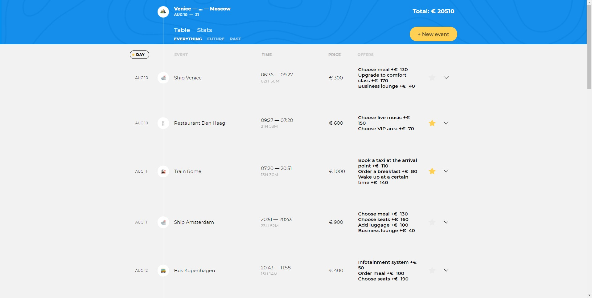
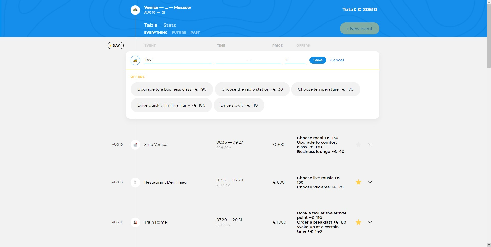
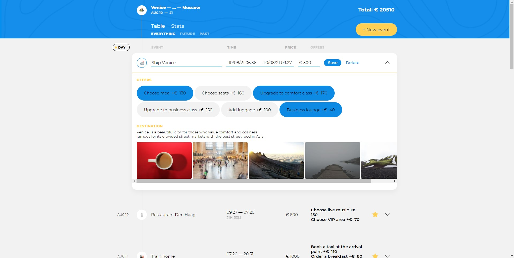
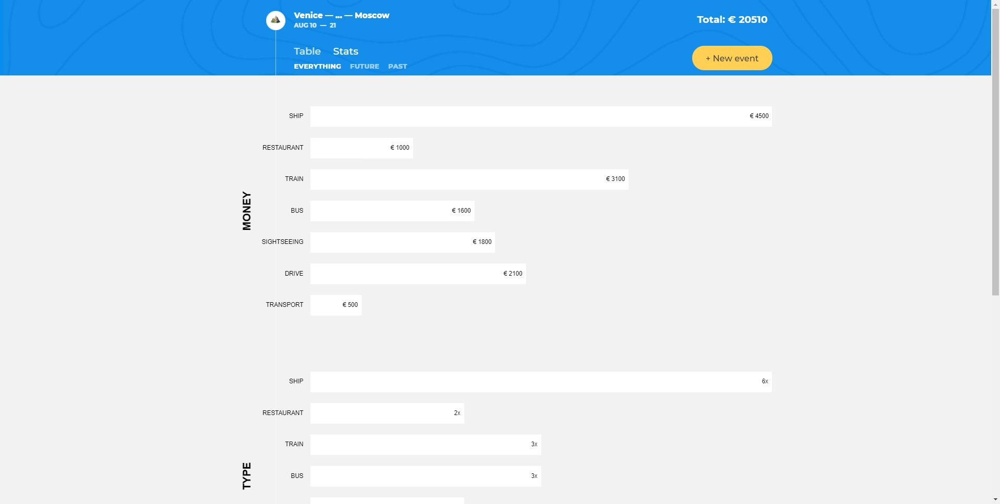

# Проект «Большое путешествие»
Big trip - SPA в котором использовались принципы ООП и архитектура MVP. Реализовано получение данных с сервера, для адаптации данных использовался паттерн адаптер. Также реализован offline режим работы приложения с использованием service worker и local storage.

## Описание функциональности
Приложение состоит из двух экранов: «Маршрут поездки» и «Статистика».

### Общий контейнер
Новая точка маршрута создаётся нажатием на кнопку «New Event». После нажатия пользователь видит форму создания новой точки маршрута, где ему необходимо заполнить несколько полей.

### Маршрут поездки

Путешествие строится из отдельных точек маршрута. Точка маршрута — отдельное событие в путешествии. 

Точка маршрута принадлежит к одному из типов: `Taxi`, `Bus`, `Train`, `Ship`, `Transport`, `Drive`, `Flight`, `Check-in`, `Sightseeing`, `Restaurant`.

Точки маршрута загружаются с сервера при старте приложения.

Точки маршрута по умолчанию располагаются сверху вниз от самых старых к самым новым по датам начала событий.

В случае отсутствия точек маршрута вместо списка отображается текст: «Click New Event to create your first point».

### Точка маршрута
По умолчанию точка маршрута в списке отображается в режиме просмотра.

В колонке «Time» отображается время и продолжительность нахождения в точке маршрута (разность между окончанием и началом события). Время маршрута отображается в формате `начало — окончание` (например, «10:30 — 11:00»). Формат продолжительности нахождения в точке маршрута зависит от длительности:

* Менее часа: `минуты` (например, `23M`);
* Менее суток: `часы минуты` (например, `02H 44M` или `12H 00M`, если минуты равны нулю);
* Более суток: `дни часы минуты` (например, `01D 02H 30M` или `07D 00H 00M`, если часы и/или минуты равны нулю).

В колонке «Offers» отображаются дополнительные опции, применённые к точке маршрута.

Кнопка «Favorite» (отображается в виде звёздочки). Добавляет точку маршрута в избранное. После добавления в избранное, кнопка меняет состояние — яркая звезда. Повторный клик по кнопке удаляет точку маршрута из избранного и возвращает кнопку в исходное состояние.

### Новая точка маршрута

Новая точка маршрута создаётся нажатием на кнопку «New Event». Форма создания новой точки маршрута появляется в самом начале списка. Кнопка при этом блокируется на время создания новой точки.

Если в момент нажатия на кнопку «New Event» был выбран фильтр или применена сортировка, то они сбрасываются на состояния «Everything» и по дате соответственно.

Нажатие кнопки «Esc» скрывает форму создания новой точки маршрута. Несохранённые изменения пропадают.

Нажатие на кнопку «New Event» закрывает открытую форму редактирования точки маршрута, если таковая была. Изменения при закрытии не сохраняются.

В форме создания новой точки маршрута пользователю доступны следующие элементы управления:

* Кнопка «Save». Сохранение точки маршрута и закрытие формы создания точки маршрута.
* Кнопка «Cancel». Отмена изменений и закрытие формы создания точки маршрута.

Для создания новой точки маршрута пользователь заполняет:

* Тип точки маршрута.
* Пункт назначения. Выбирается из списка предложенных значений, полученных с сервера. Пользователь не может ввести свой вариант для пункта назначения.
* Дата и время начала события. Выбор времени и даты осуществляется с помощью библиотеки flatpickr.js. Выбранная дата и время отображаются в поле в формате: день/месяц/год часы:минуты (например «25/12/2019 16:00»).
* Дата и время окончания события. Формат и требования аналогичны дате начала. Дата окончания не может быть меньше даты начала события.
* Стоимость. Целое число.
* Дополнительные опции. В зависимости от типа точки маршрута пользователь может выбрать дополнительные опции (offers).

Информация о дополнительных опциях загружается с сервера.

Дополнительные опции отображаются после выбора (изменения) типа точки маршрута.

Пользователь может отметить одну или несколько дополнительных опций.

Дополнительная опция применяется к точке маршрута один раз. Повторный клик на дополнительную опцию отменяет её применение.

Список дополнительных опций доступен не для всех типов точек маршрута. Для некоторых типов точек дополнительные опции могут отсутствовать. В этом случае контейнер для вывода дополнительных опций не отображается.

Выбор дополнительных опций влияет на общую стоимость путешествия. Стоимость точки маршрута, которую ввёл пользователь в соответствующее поле ввода, при этом не изменяется.

При изменении типа точки маршрута выбранный ранее список дополнительных опций очищается.

После выбора пункта назначения появляется блок «Destination». В нём отображается информация о месте назначения (изображения, текст). Информация в блоке «Destination» всегда соответствует выбранному пункту назначения. При изменении пункта назначения информация в блоке «Destination» обновляется.

Информация для блока «Destination» загружается с сервера.

Если информация о пункте назначения отсутствует, блок «Destination» не отображается.

После сохранения точка маршрута располагается в списке точек маршрута в соответствии с датой начала события по этой точке.

Если дата начала двух и более точек совпадает, расположение этих точек относительно друг друга реализуется на усмотрение разработчика.

Введённые пользователем данные экранируются.

### Редактирование точки маршрута

Для перехода к форме редактирования точки маршрута пользователь кликает по кнопке с изображением «Стрелка вниз» в правом углу карточки точки маршрута.

В форме редактирования пользователю доступны следующие элементы управления:

* Кнопка «Save». Сохраняет изменения, закрывает форму редактирования.
* Кнопка «Delete». Удаляет точку маршрута, закрывает форму редактирования.

В форме редактирования представлены все поля, которые пользователь заполняет при создании новой точки маршрута (см. раздел «Новая точка маршрута»). Правила их поведения сохраняются.

При нажатии кнопки «Esc» или кнопки с изображением «Стрелка вниз» в правом углу форма редактирования закрывается. Несохранённые изменения пропадают.

Одновременно может быть открыта только одна форма создания/редактирования.

При смене типа точки маршрута блок с дополнительными опциями перерисовывается, если у нового выбранного типа точки есть опции; или скрывается, если опций нет. Остальные данные, введённые пользователем, должны быть сохранены.

При смене пункта назначения блок с описанием перерисовывается; или скрывается, если у пункта назначения нет описания и фотографий к нему. Остальные данные, введённые пользователем, должны быть сохранены.

Если пользователь внёс изменения в точку маршрута, не выполнил сохранение и пытается перейти к редактированию другой точки маршрута либо создать новую, то в этом случае открытая форма редактирования скрывается без сохранения изменений. После открывается другая форма редактирования или форма создания новой точки маршрута.

После сохранения изменений точка маршрута располагается в списке точек маршрута в порядке определённом текущей сортировкой (по дате, по длительности или по стоимости).

### Фильтры
В приложении предусмотрено несколько фильтров:

* Everything — полный список точек маршрута;
* Future — список запланированных точек маршрута, т. е. точек, у которых дата начала события больше или равна текущей дате;
* Past — список пройденных точек маршрута, т. е. точек у которых дата окончания маршрута меньше, чем текущая.

Выбор любого из фильтров приводит к отрисовке только тех точек маршрута, которые соответствуют выбранному фильтру. При смене фильтра сортировка по дате сохраняется.

`Кнопка фильтра становится недоступной`, если фильтру не соответствует ни одна из точек маршрута.

### Сортировка
Пользователю доступна возможность сортировки точек маршрута по стоимости (клик по заголовку колонки «Price») и длительности (клик по заголовку колонки «Time»). Сортировка работает в одном направлении — от максимального к минимальному: при сортировке по стоимости в начале списка окажутся самые дорогие точки маршрута, при сортировке по длительности — самые долгие.

Для отмены сортировки и возвращению к исходной сортировке по датам пользователь кликает по заголовку колонки «Day».

При смене фильтра или переключении с экрана со списком точек маршрута на экран статистики и обратно сортировка сбрасывается на состояние «Day».

### Статистика

Статистика «Stats» позволяет пользователю проанализировать расходы и время, затраченное на путешествие. Для удобства просмотра и анализа эта информация представлена в виде нескольких диаграмм: «Money» (финансовые расходы по каждому типу точек маршрута), «Type» (количество того или иного типа точки маршрута) и «Time-spend» (затраченное время относительно типа точки маршрута).

Для просмотра статистики пользователь нажимает на кнопку «Stats».

Диаграмма «Money» показывает финансовые затраты в разрезе точек маршрута. Она позволяет ответить на вопрос: «Сколько за время путешествия было в сумме потрачено на такси или рестораны?» Диаграмма «Money» не учитывает дополнительные опции, только стоимость точек маршрута.

Диаграмма «Type» показывает статистику по типам точек маршрута. Диаграмма отвечает на вопрос: «Сколько раз нам придётся воспользоваться самолётом, сколько раз арендовать отель и так далее».

Диаграмма «Time-Spend» показывает сколько времени было затрачено на отдельные точки маршрута. Диаграмма позволяет ответить на вопрос: «Сколько дней в сумме пользователь проведёт в самолёте, такси, ресторане и так далее».

### Дополнительно
`Наименование маршрута путешествия формируется автоматически` и состоит из пунктов назначения (названий городов), разделённых тире: «Amsterdam — Geneva — Chamonix». Если городов больше 3-х, то в наименовании маршрута отображается первый и последний город, разделённые многоточием: «Amsterdam —... — Chamonix».

`Даты путешествия в шапке заполняются автоматически`. Дата начала всего путешествия соответствует дате начала первой точки маршрута. Дата окончания — дате завершения последней точки маршрута. Например, «18 AUG — 6 OCT».

`Общая стоимость путешествия пересчитывается` при создании/изменении/удалении любой точки маршрута.

`Офлайн-режим.`

Приложение кэширует статические ресурсы (разметку, стили, изображения, шрифты) с помощью ServiceWorker и умеет их отображать без использования сети интернет.

При переходе в офлайн-режим выводится индикатор для пользователя о том, что нет сети. Создание и редактирование точки маршрута в режиме офлайн недоступно. Единственное доступное действие — добавление точки маршрута в избранное.

В случае, если доступ к сети пропал в процессе создания, редактирования или удаления точки маршрута, эти действия должны завершиться с ошибкой; на форме должен сработать эффект покачивания головой, а пользователь должен быть уведомлен, что нет сети. При отсутствии доступа к сети пользователь может закрыть форму без сохранения изменений.

При появлении доступа к сети все изменения синхронизируются с сервером.

---

## Команды

### `npm start`

Запускает приложение в режиме разработчика.

### `npm run build`

Генерирует продакшн сборку приложения в папку `public`. 
Файлы оптимизируются и минифицируются.

### `npm run eslint`

Запускает eslint.

---

Репозиторий создан для обучения на профессиональном курсе «[JavaScript. Архитектура клиентских приложений](https://htmlacademy.ru/intensive/ecmascript)» от [HTML Academy](https://htmlacademy.ru).